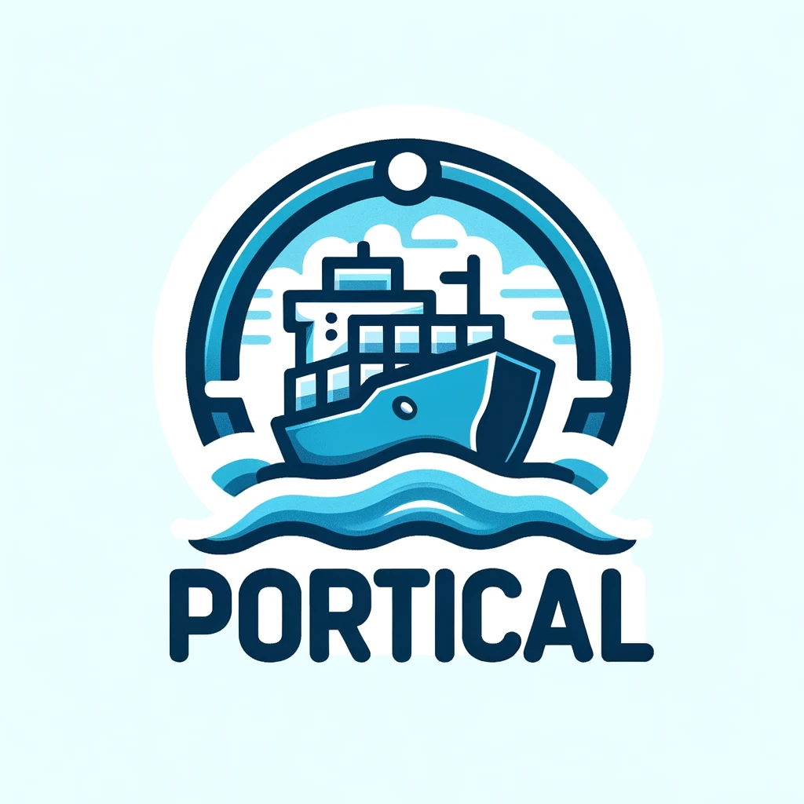

# Portical

## Overview
Portical is a docker container designed to manage UPnP port forwarding rules for Docker containers. 
It allows users to set up port forwarding based on container labels and supports updating these rules periodically.
It was inspired by [Traefik Proxy](https://traefik.io/traefik/) autoconfiguration of HTTP port forwarding rules.

## Requirements
- Some Docker containers you want to expose to the internet
- UPnP-enabled internet gateway (tested on Google Nest Wifi)

## Usage
There are 2 parts to Portical:

1. Add the `portical.upnp.forward` label and rules (`8080:80` or `8080:80/tcp` etc) to your Docker containers to expose them to the internet.
2. Run Portical to set up port forwarding rules and keep them up to date.

### Part 1: Adding the `portical.upnp.forward` label
**Docker**:

```shell
# Forward port 9999 on your router to port 8888 on the docker host then to port 80 on the container (for illustration purposes)
docker run nginx:latest \
 --label portical.upnp.forward=9999:8888 
 -p 8888:80
```

**Docker Compose**:

```yaml
version: '3.8'

services:
  nginx: 
    image: 'nginx:latest'
    ports: 
      - '8888:80'
    labels:
      - 'portical.upnp.forward=9999:8888'
```

### Part 2: Running Portical

#### Overview

- **Commands**:
   - `poll`: Continuously updates port forwarding rules at specified intervals.
   - `update`: Finds containers with the specified label and sets up port forwarding once only.  (mainly for testing)
     - Warning UPnP rules expire.

- **Options (all optional)**:
   - `-r`, `--root [URL]`: Set the UPnP root URL. (use if autodiscovery does not work)
   - `-d`, `--duration [SECONDS]`: Set the polling interval in seconds (default: `15` seconds).
   - `-l`, `--label [LABEL]`: Specify the Docker label to filter containers (default: `portical.upnp.forward`.
   - `-v`, `--verbose`: Enable verbose output.

- **Environment Variables**:
   - `PORTICAL_UPNP_ROOT_URL`: The root URL for the UPnP device.
   - `PORTICAL_POLL_INTERVAL`: Interval in seconds for polling and updating rules (default: 15 seconds).

### Docker

#### Run Once with Autodiscovery (for testing)

```shell
docker run --rm -v '/var/run/docker.sock:/var/run/docker.sock' \
  danielbodart/portical:latest /opt/portical/run -v update
```

This will use autodiscovery to find your internet gateway. 

#### Run Once with explicit root URL

If autodiscovery does not work, you can specify the UPnP root 
URL using the `-r` or `--root` option:

```shell
docker run --rm -v '/var/run/docker.sock:/var/run/docker.sock' \
  danielbodart/portical:latest /opt/portical/run \
  -r "http://internal-gateway-ip:5000/somePath.xml" update
```

#### Poll and Demonize

```shell
docker run --rm -d -v '/var/run/docker.sock:/var/run/docker.sock' \
  danielbodart/portical:latest /opt/portical/run poll
```

This will use autodiscovery to find your internet gateway.

#### Poll and Demonize with explicit root URL

If autodiscovery does not work, you can specify the UPnP root
URL using the `-r` or `--root` option:

```shell
docker run --rm -d -v '/var/run/docker.sock:/var/run/docker.sock' \
  danielbodart/portical:latest /opt/portical/run \
  -r "http://internal-gateway-ip:5000/somePath.xml" poll
```


### Docker Compose Setup (Recommended)

The ideal solution is to use Docker Compose to run Portical and your other containers in all one place:

```yaml
version: '3.8'

services:

  portical:
    image: 'danielbodart/portical:latest'
    environment:
      - PORTICAL_UPNP_ROOT_URL="http://internal-gateway-ip:5000/somePath.xml" # Optional
    volumes:
      - '/var/run/docker.sock:/var/run/docker.sock' # Required
    restart: unless-stopped
    network_mode: none

  # This is a service we are going to expose to the internet (for illustration purposes only)
  minecraft_java: 
    image: 'gameservermanagers/gameserver:mc'
    restart: unless-stopped
    ports: 
      - '25565:25565' # This is the port that will be exposed on the host (when in bridge network mode)
    labels:
    - 'portical.upnp.forward=25565:25565' # This is the port that will be exposed on your router

  # This is another service we are going to expose to the internet (for illustration purposes only)
  nginx: 
    image: 'nginx:latest'
    restart: unless-stopped
    network_mode: custom_network # This is a custom network (could be macvlan or ipvlan), notice no ports are needed
    labels:
      - 'portical.upnp.forward=8000:80/tcp'
```


## How it Works
1. **Forwarding Setup**: For each Docker container with the specified label `portical.upnp.forward` and a rule `${external_port}:${internal_port}/${optional-protocol}`, the application sets up port forwarding using UPnP. eg:
    - `9999:8000/tcp` will forward port `9999` on internet gateway to the docker network's port `8000` using only the TCP protocol.
    - `25565:25565` will forward port `25565` on internet gateway to the docker network's port `25565` using both TCP and UDP protocol.
    - `19132:19132/udp` will forward port `19132` on internet gateway to the docker network's port `19132` using only the UDP protocol.
2. **Network Handling**: Supports different network drivers and configures port forwarding accordingly. Works with:
    - `bridge` network driver
    - `host` network driver
    - `macvlan` network driver
    - `ipvlan` network driver

It's worth undertsanding that depending on the network driver, how port forwarding works is different. 
For example, if you are using the `bridge` network driver (the default), traffic will be making a double hop, once from
the internet gateway to the docker host (controlled by the `portical.upnp.forward` label rule), then from the docker host to 
the target container (controlled by the normal docker ports `-p` flag or `ports` yaml option).
However, if you are using `host`, `macvlan` or `ipvlan` network driver, traffic will only make a single hope from the 
internet gateway to the target container (and you will not be required specify the `-p` flag or `ports` yaml option).

## TODO

* WARNING: Currently, the script will remove and recreate ports on each poll (Fixing as soon as possible!)
* Add support for automatic port forwarding based on exposed ports of container (only for bridge network driver)
* Add DockerHub CI build
* Test more corner cases!


## Contributing
Contributions to Portical are welcome. Please submit your contributions as pull requests on GitHub.

## License
Apache License 2.0
